# 🛍️ Swoop

> **Find it. Buy it. Swoop it.**


---

## Live Demo

https://swoop-marketplace-04ef01d99e89.herokuapp.com/

## GitHub Repository

https://github.com/Nic1Mic/swoop

---

# Table of Contents

1. Project Overview
2. User Experience (UX)
3. Agile Development
4. User Stories
5. Design
6. Wireframes
7. Features
8. Marketplace Workflow
9. CRUD Functionality
10. Database Design
11. System Architecture
12. Third-Party Integrations & Security
13. Technologies Used
14. Project Structure
15. Testing
16. Validation
17. Bugs & Fixes
18. Deployment
19. Future Improvements
20. Credits
21. Author

---

# 1. Project Overview

Swoop is a fully functional marketplace built with Django where users can purchase products securely using a user-friendly and responsive interface. Swoop also provides users with the ability to sign up for accounts, list products for sale, view the available products, add listings to their wishlists, and even promote their products using Stripe Checkout.

This application was developed to provide a basic demonstration of the functionalities of modern-day marketplaces and the usage of current-day technologies in web development and deployments. Several third-party cloud services such as Stripe, Cloudinary, Gmail SMTP, and Heroku have been used in the creation of this application.

The focus during development was on developing clean code, adhering to Django best practices, securing the application through authentication, separation of the development and production environment using environment variables, and building a scalable application architecture.
---

## Purpose

The main goal of the Swoop application is to create a comprehensive marketplace platform that will enable interaction between the buyers and sellers via a highly secure and responsive web application.

The project was developed to showcase practical experience in:

- Full-stack web development using Django
- Object-oriented programming with Python
- Relational database design
- User authentication and authorization
- CRUD (Create, Read, Update, Delete) operations
- Secure payment processing using Stripe Checkout
- Cloud-based image management using Cloudinary
- Transactional email delivery using Gmail SMTP
- PostgreSQL database integration
- Production deployment using Heroku
- Responsive front-end development
- Version control using Git and GitHub

---

## Project Objectives

The primary objectives of the project were to:

- Develop a production-ready online marketplace.
- Implement secure user authentication and account management.
- Allow authenticated users to create, edit and manage product listings.
- Store uploaded media securely using Cloudinary.
- Process secure online payments using Stripe Checkout.
- Allow sellers to promote listings through featured advertisements.
- Deliver automated transactional email notifications.
- Deploy the application to a live production environment using Heroku.
- Produce comprehensive technical documentation and testing evidence.

---

## Key Features

The current implementation includes:

- Secure user registration and authentication
- Public seller profiles
- Product listing management
- Category-based marketplace
- Wishlist functionality
- Featured listing promotion
- Stripe payment integration
- Cloudinary image hosting
- Gmail SMTP email notifications
- Responsive user interface
- Django administration panel
- PostgreSQL production database
- Production deployment on Heroku

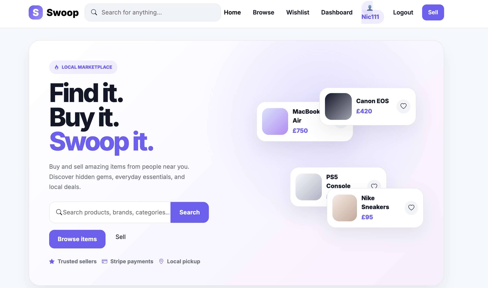


---

# 2. User Experience (UX)

## User-Centred Design

Swoop was built following a user-centred design process, taking into account simplicity, accessibility and navigability of the application. The key aim of Swoop is to offer its users an easy-to-use marketplace in which they could easily look through the available products, make a listing and buy products.

The interface of the application corresponds to the current standards of marketplaces, featuring card-based products representation, uniform navigations on all pages and explicit calls to action for purchasing, selling and managing listings.

The application has been designed with the aim of offering accessibility and responsiveness on different devices (desktop, tablet, mobile).

---

## Target Audience

Swoop is intended for users who wish to buy or sell second-hand and new products through a simple and secure online marketplace.

The platform is suitable for:

- Individuals selling unwanted items.
- Buyers searching for local products.
- Small independent sellers.
- Students looking for affordable goods.
- Users seeking an easy-to-use marketplace.

---

## Project Goals

The primary goals of the project were to:

- Build a production-ready marketplace using Django.
- Demonstrate full-stack software development.
- Implement secure authentication and user management.
- Integrate cloud-based media storage.
- Implement secure online payments.
- Deliver transactional email notifications.
- Create a responsive user interface.
- Deploy the application to a cloud-hosted production environment.

---

## Buyer Goals

A buyer should be able to:

- Browse available listings.
- Search for products.
- View detailed product information.
- View seller profiles.
- Save products to a wishlist.
- Purchase products securely using Stripe.
- Receive purchase confirmation emails.
- Browse the marketplace on any device.

---

## Seller Goals

A seller should be able to:

- Register an account.
- Create new listings.
- Upload product images.
- Edit existing listings.
- Delete unwanted listings.
- Promote listings using Stripe Checkout.
- View all active listings.
- Receive promotion confirmation emails.
- Receive notifications when an item has been sold.

---

## Administrator Goals

An administrator should be able to:

- Manage users.
- Manage product categories.
- Manage marketplace listings.
- Remove inappropriate content.
- Access the Django administration panel.
- Maintain the integrity of marketplace data.

---

## Accessibility

Accessibility was considered throughout the development process.

The application includes:

- Semantic HTML5 structure.
- Responsive layouts.
- Consistent navigation.
- Clear button styling.
- Accessible form labels.
- Readable typography.
- Appropriate colour contrast.
- Mobile-friendly layouts.

---

## Responsive Design

Swoop follows a mobile-first responsive design strategy.

The interface has been designed to function across multiple screen sizes including:

- Desktop
- Laptop
- Tablet
- Mobile

Bootstrap's responsive grid system has been combined with custom CSS to ensure that navigation, forms and marketplace listings adapt smoothly to different viewport sizes.

---

## UX Images

### Homepage


### Browse Listings

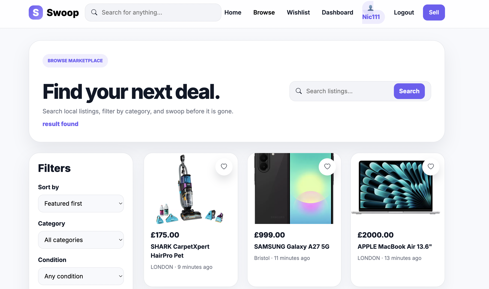

### Seller Profile

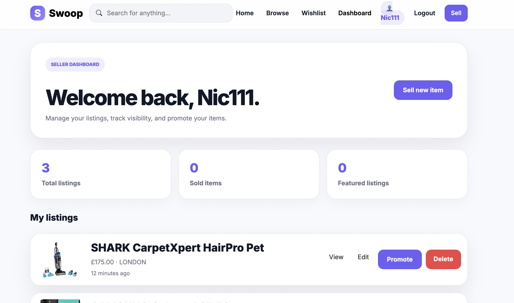

### Dashboard

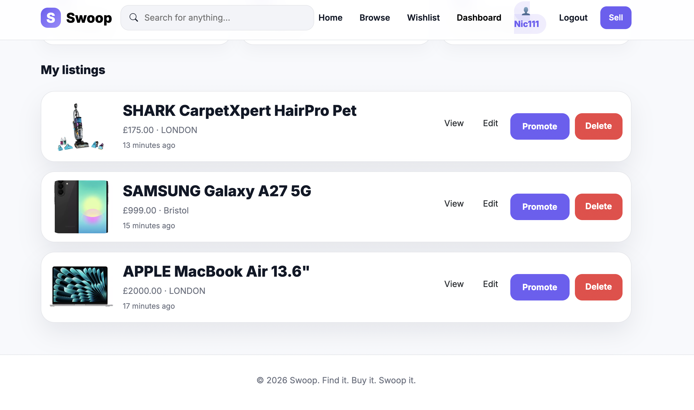

---


# 3. Agile Development

## Development Methodology

The project was developed following an Agile-inspired workflow, where features were implemented incrementally and continuously refined throughout development.

Rather than attempting to build the complete application in a single iteration, the project evolved through multiple development phases, allowing functionality to be tested, improved and extended over time.

Git and GitHub were used throughout development to manage source control, track changes and maintain a complete history of the project's evolution.

---

## Project Planning

Before development began, the application was divided into logical feature groups (Epics). Each Epic contained multiple user stories describing specific functionality from the perspective of different users.

This approach helped prioritise development while ensuring that the application remained scalable and maintainable.

---

## Project Epics

### Epic 1 – User Authentication

Allow users to register, log in securely and manage authenticated sessions.

Features:

- User registration
- User login
- Logout
- Password validation
- Authentication protection

---

### Epic 2 – Marketplace

Allow sellers to create and manage marketplace listings.

Features:

- Create listing
- Edit listing
- Delete listing
- View listing
- Product categories
- Product conditions
- Image uploads

---

### Epic 3 – Seller Profiles

Provide public seller profiles displaying marketplace activity.

Features:

- Seller information
- Active listings
- Featured listings
- Sold listings
- Seller statistics

---

### Epic 4 – Wishlist

Allow authenticated users to save products for future viewing.

Features:

- Add to wishlist
- Remove from wishlist
- View saved products

---

### Epic 5 – Payments

Allow secure online payments using Stripe Checkout.

Features:

- Purchase listings
- Promote listings
- Checkout success
- Checkout cancellation

---

### Epic 6 – Cloud Media Storage

Store uploaded media securely using Cloudinary.

Features:

- Image uploads
- Cloud media storage
- Persistent media
- Optimised delivery

---

### Epic 7 – Email Notifications

Provide automated transactional emails.

Features:

- Welcome email
- Purchase confirmation
- Promotion confirmation
- Seller sale notification

---

## MoSCoW Prioritisation

### Must Have

- User registration
- Login and logout
- Product listings
- CRUD functionality
- Categories
- Stripe Checkout
- Cloudinary integration
- Seller dashboard
- Responsive design
- PostgreSQL deployment

---

### Should Have

- Wishlist
- Seller profiles
- Featured listings
- Transactional emails

---

### Could Have

- Product reviews
- Seller ratings
- Saved searches
- Advanced filters
- Notification centre

---

### Won't Have (Current Release)

The following features have been identified for future development:

- Real-time messaging
- Mobile application
- REST API
- AI product recommendations
- Multi-language support

---

## Development Timeline

| Milestone | Status |
|-----------|--------|
| Django project setup | ✅ |
| Authentication | ✅ |
| Marketplace listings | ✅ |
| Categories | ✅ |
| Dashboard | ✅ |
| Wishlist | ✅ |
| Seller profiles | ✅ |
| Stripe Checkout | ✅ |
| Cloudinary integration | ✅ |
| Gmail SMTP | ✅ |
| PostgreSQL deployment | ✅ |
| Responsive design | ✅ |
| Technical documentation | 🚧 |
| Messaging system | 🔜 |
| Reviews & ratings | 🔜 |

---

# 4. User Stories

The following user stories were identified during the planning stage of the project. They represent the core functionality required for different types of users interacting with the marketplace.

---

## First-Time Visitor

As a first-time visitor, I want to:

- Understand the purpose of the marketplace immediately.
- Browse listings without creating an account.
- Search for products.
- View product details.
- View seller profiles.
- Register quickly if I wish to buy or sell products.
- Navigate the website easily on both desktop and mobile devices.

---

## Registered User

As a registered user, I want to:

- Register and log into my account securely.
- Edit my account information.
- Browse available products.
- Search for listings.
- Save products to my wishlist.
- View detailed product information.
- Purchase products securely.
- Receive confirmation emails after important actions.

---

## Seller

As a seller, I want to:

- Create new listings.
- Upload product images.
- Assign categories.
- Set prices.
- Edit my listings.
- Delete listings.
- Promote listings using Stripe Checkout.
- View my dashboard.
- View my seller profile.
- Receive email notifications when products are sold.

---

## Buyer

As a buyer, I want to:

- Browse products by category.
- Search for products.
- View product details.
- Save favourite products.
- Purchase products securely using Stripe.
- Receive purchase confirmation emails.
- View seller information before purchasing.

---

## Administrator

As an administrator, I want to:

- Manage users.
- Manage product categories.
- Manage marketplace listings.
- Remove inappropriate content.
- Monitor marketplace activity.
- Access the Django administration panel.
- Maintain application integrity.

---

## User Story Acceptance Criteria

Each implemented feature was considered complete only when it satisfied the following criteria:

- The feature performs its intended function.
- The interface is intuitive and responsive.
- Appropriate validation is performed.
- Error handling is implemented where required.
- Authentication is enforced when necessary.
- Database records are updated correctly.
- Success and error feedback is displayed to the user.

---

## User Story Progress

| User Story | Status |
|------------|:------:|
| Register account | ✅ |
| Login | ✅ |
| Logout | ✅ |
| Create listing | ✅ |
| Edit listing | ✅ |
| Delete listing | ✅ |
| Browse listings | ✅ |
| Search listings | ✅ |
| Wishlist | ✅ |
| Seller profile | ✅ |
| Stripe purchase | ✅ |
| Promote listing | ✅ |
| Cloudinary uploads | ✅ |
| Email notifications | ✅ |
| Messaging system | 🔜 |
| Reviews & Ratings | 🔜 |
| Notifications | 🔜 |

---

# 5. Design

## Design Philosophy

The visual identity of Swoop was inspired by modern online marketplaces such as Facebook Marketplace, eBay and Vinted. The objective was to create an interface that feels familiar to users while maintaining a clean, modern and professional appearance.

The interface was designed with the following principles in mind:

- Simplicity over complexity.
- Clear visual hierarchy.
- Minimal distractions.
- Fast product discovery.
- Responsive layouts across all devices.
- Consistent styling throughout the application.

The design aims to allow users to browse, buy and sell products with minimal effort while keeping important actions clearly visible.

---

# Colour Scheme

A modern blue colour palette was selected to communicate trust, security and professionalism.

| Colour | Usage | Hex |
|---------|------|------|
| Primary Blue | Buttons, Links, Highlights | `#2563EB` |
| Dark Blue | Navigation | `#1E3A8A` |
| Light Blue | Hover States | `#DBEAFE` |
| White | Cards & Backgrounds | `#FFFFFF` |
| Light Grey | Page Background | `#F8FAFC` |
| Border Grey | Card Borders | `#E5E7EB` |
| Dark Text | Headings | `#111827` |
| Secondary Text | Descriptions | `#6B7280` |
| Success Green | Success Messages | `#16A34A` |
| Danger Red | Delete Buttons & Errors | `#DC2626` |

---

# Typography

Swoop uses the **Inter** font family throughout the application.

Reasons for choosing Inter:

- Modern appearance.
- Excellent readability.
- Optimised for digital interfaces.
- Consistent rendering across operating systems.
- Frequently used in modern SaaS applications.

Typography hierarchy:

| Element | Weight |
|----------|-------|
| Page Titles | 700 |
| Section Titles | 600 |
| Buttons | 600 |
| Navigation | 500 |
| Body Text | 400 |

---

# Layout

The application follows a card-based layout commonly used by modern marketplace platforms.

Major interface components include:

- Fixed navigation bar
- Search bar
- Product cards
- Seller profile cards
- Dashboard cards
- Responsive forms
- Bootstrap grid layout
- Responsive footer

The layout has been designed to maximise content visibility while maintaining generous spacing between interface elements.

---

# User Interface Components

The application includes a consistent design language across all pages.

Major UI components include:

- Navigation bar
- Product cards
- Seller profile cards
- Dashboard statistics
- Wishlist cards
- Forms
- Buttons
- Alerts
- Category badges
- Featured listing badges
- Sold labels

Each component was designed to provide visual consistency throughout the application.

---

# Responsive Design

A mobile-first approach was followed throughout development.

The interface automatically adapts to:

- Desktop
- Laptop
- Tablet
- Mobile

Bootstrap's responsive grid system combined with custom CSS ensures that navigation menus, listings, forms and dashboards remain usable regardless of screen size.

Responsive testing was carried out on multiple viewport sizes using Chrome Developer Tools.

---

# 6.Wireframes

Wireframes were produced before development to plan page layouts, user journeys and navigation.

The wireframes helped establish:

- Navigation flow
- Homepage layout
- Listing page structure
- Dashboard layout
- Seller profile design
- Responsive behaviour

## Homepage Wireframe

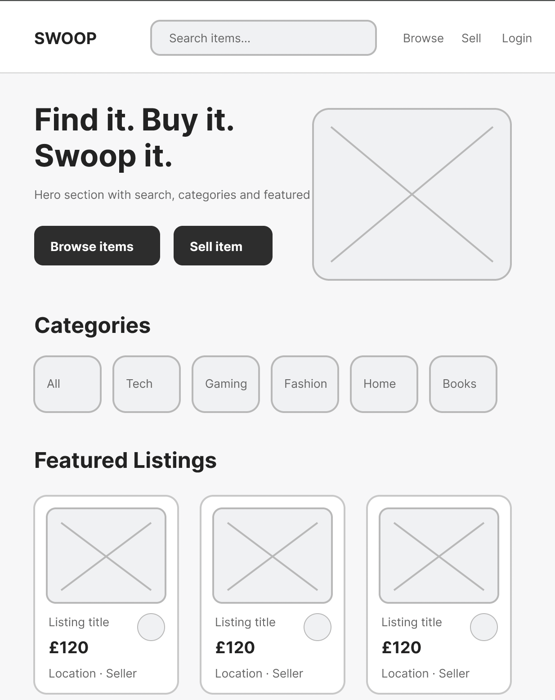

---

## Browse Listings Wireframe

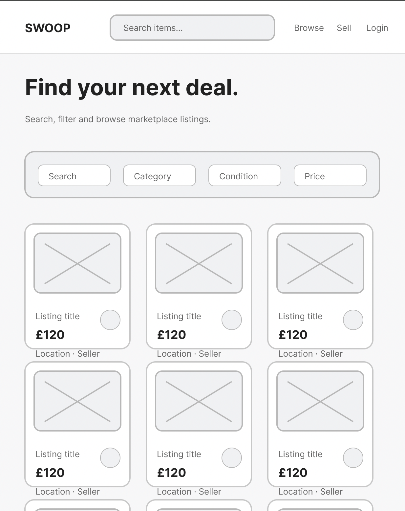

---

## Listing Detail Wireframe

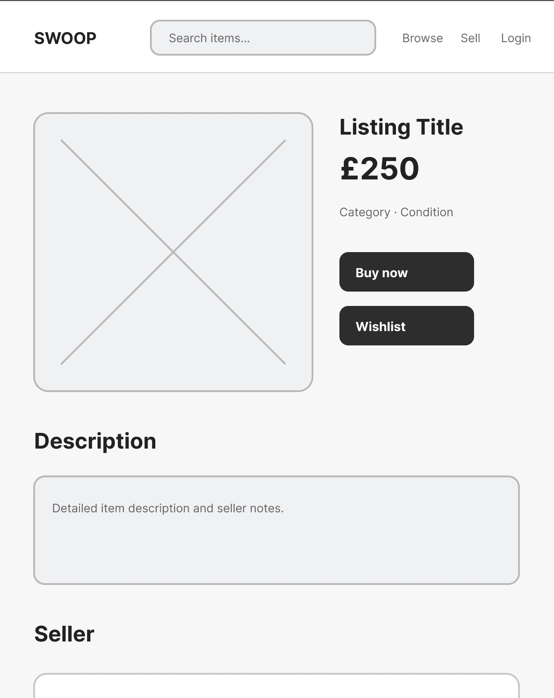

---

## Seller Profile Wireframe

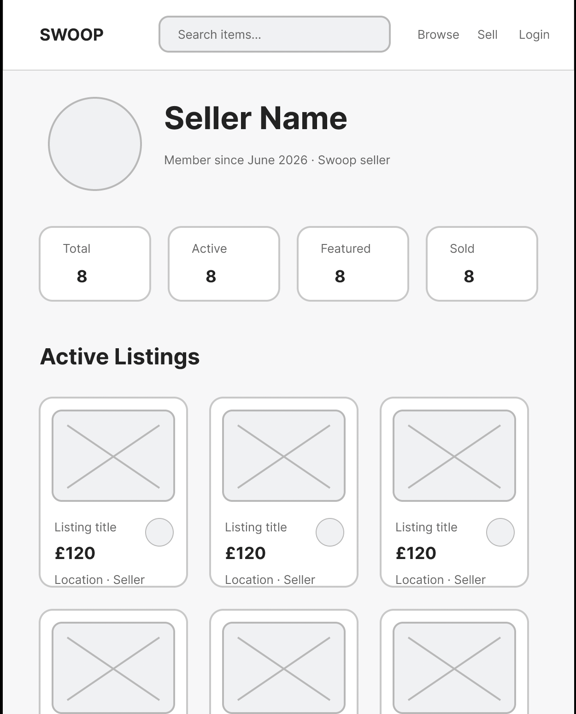

---

## Dashboard Wireframe

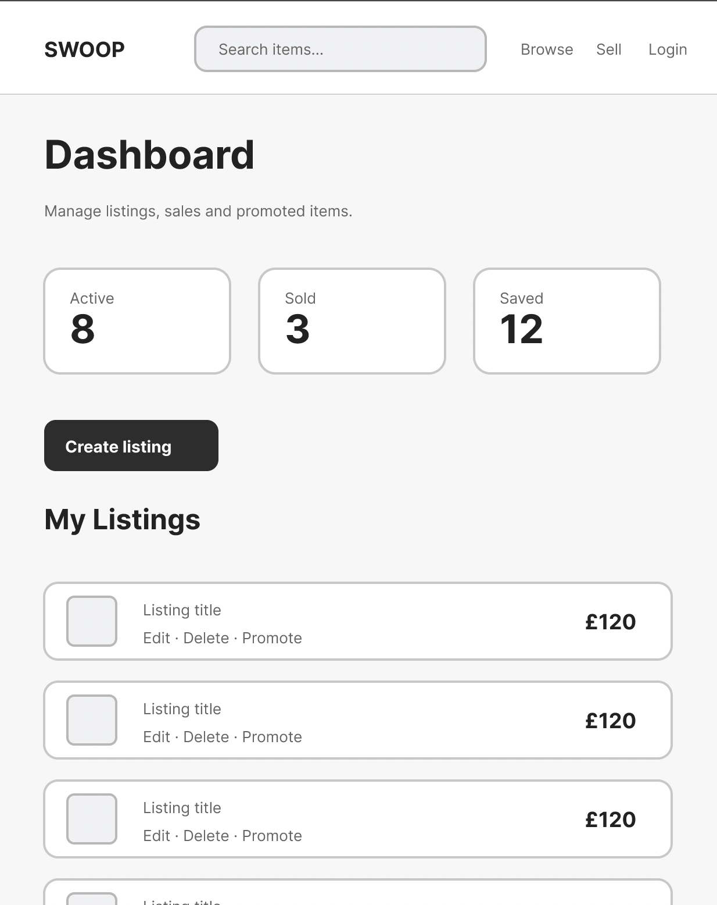

---

# Final User Interface

## Homepage


---

## Browse Listings


---

## Listing Detail

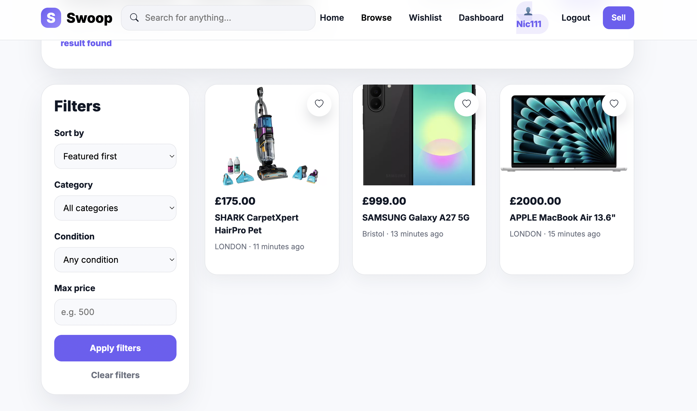

---

## Seller Profile


---

## Dashboard


---

## Wishlist

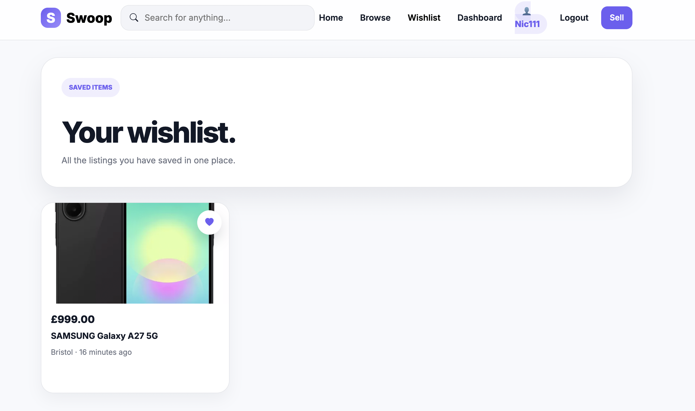

---


# 7. Features

The application has been designed around the core functionality expected from a modern online marketplace. Each feature has been implemented with usability, scalability and maintainability in mind.

---

# Homepage

The homepage acts as the main entry point into the application.

Its primary objective is to immediately present visitors with available marketplace listings while providing quick navigation to the application's core features.

### Key Features

- Featured marketplace listings
- Search functionality
- Responsive navigation
- Category shortcuts
- Product cards
- Seller information
- Call-to-action buttons

### Technical Implementation

- Django Template Views
- Bootstrap responsive layout
- Dynamic database queries
- Reusable listing card components

### Screenshot


---

# Browse Listings

The marketplace page displays all available listings and allows visitors to browse products quickly.

### Key Features

- Product grid
- Category filtering
- Search results
- Featured products
- Product cards
- Responsive layout

### Technical Implementation

- Django ORM queries
- Dynamic template rendering
- Category relationships
- Search filtering

### Screenshot


---

# Listing Detail

Each product has its own dedicated page displaying detailed information.

### Information Displayed

- Product image
- Title
- Description
- Price
- Category
- Condition
- Seller
- Location
- Creation date

### Available Actions

Authenticated users can:

- Purchase the product
- Save to wishlist
- View seller profile

Owners can:

- Edit listing
- Delete listing
- Promote listing

### Technical Implementation

- DetailView logic
- Permission checks
- Stripe Checkout integration
- Cloudinary media rendering

### Screenshot


---

# User Registration & Authentication

The authentication system allows users to securely create accounts and access protected marketplace functionality.

### Features

- User registration
- Secure login
- Logout
- Password validation
- Session management

### Security

- Django Authentication Framework
- Password hashing
- CSRF protection
- Authentication decorators

### Screenshot

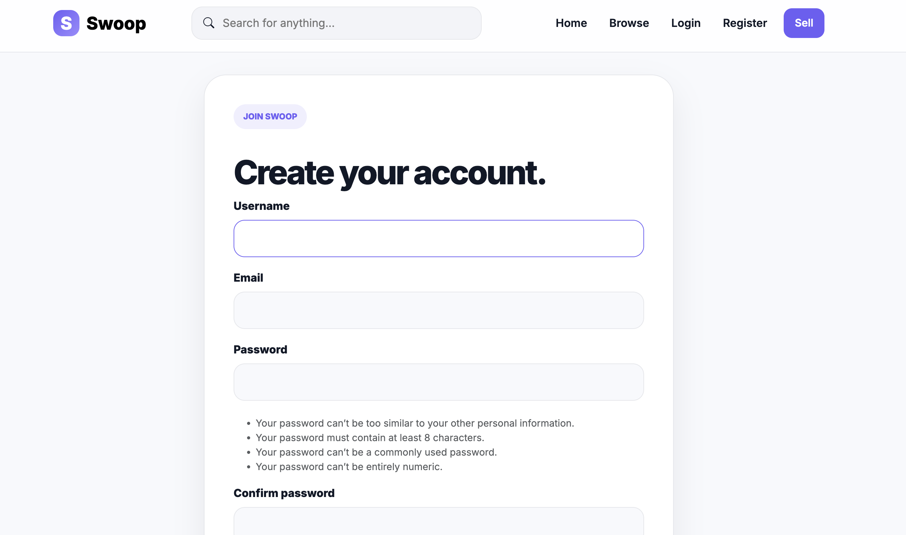

---

# Seller Profiles

Each registered seller has a dedicated public profile displaying marketplace activity.

### Information Displayed

- Username
- Member since
- Active listings
- Featured listings
- Sold listings
- Seller statistics

### Benefits

- Increased buyer trust
- Marketplace transparency
- Easier product discovery

### Screenshot


---

# User Dashboard

Authenticated users have access to a personalised dashboard.

### Dashboard Features

- View own listings
- Edit listings
- Delete listings
- Promote listings
- Create new listings

### Technical Implementation

- Login protected views
- ORM filtering
- Dynamic template rendering

### Screenshot


---

# Wishlist

Users can save products for future viewing.

### Features

- Add product
- Remove product
- View saved products

### Technical Implementation

- Many-to-many relationship
- User authentication
- Dynamic rendering

### Screenshot


---

# Stripe Checkout

Stripe Checkout provides secure payment processing without storing sensitive payment information within the application.

### Features

- Secure purchases
- Featured listing promotion
- Hosted checkout pages
- Payment confirmation
- Cancel handling

### Benefits

- PCI compliant
- Secure transactions
- Trusted payment provider

### Screenshot

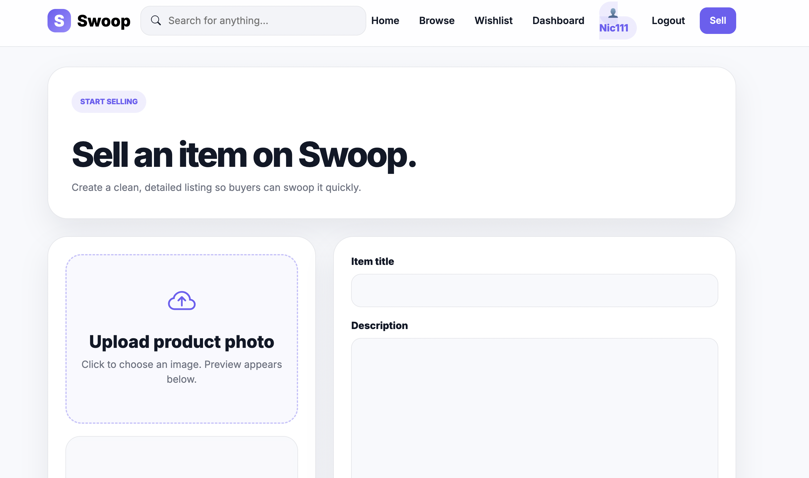

---

# Cloudinary Integration

Cloudinary is used to store uploaded product images.

### Benefits

- Persistent cloud storage
- Fast CDN delivery
- Image optimisation
- Automatic resizing
- No local media persistence required

### Technical Implementation

- django-cloudinary-storage
- Environment variables
- Cloudinary API

---

# Email Notifications

Transactional emails improve communication between buyers and sellers.

### Emails Sent

- Welcome email
- Purchase confirmation
- Listing promoted confirmation
- Seller notification after sale

### Technical Implementation

- Gmail SMTP
- Django send_mail()
- Environment variables

---

# Django Administration Panel

The Django administration interface provides complete management of marketplace content.

Administrators can manage:

- Users
- Categories
- Listings
- Orders
- Payments

### Screenshot

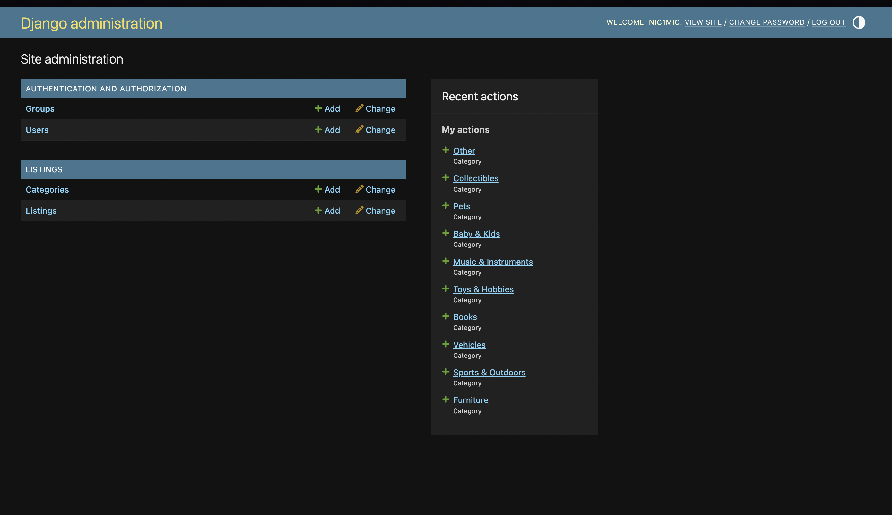

---

# 8. Marketplace Workflow

The marketplace has been designed around a straightforward workflow that allows users to browse products, create listings, purchase items and manage their activity from a personalised dashboard.

The workflow below illustrates how buyers, sellers and the application interact throughout the lifecycle of a listing.

---

## Seller Workflow

1. Register a new account.
2. Log into the application.
3. Create a new listing.
4. Upload one or more product images.
5. Select a category.
6. Set the product price.
7. Publish the listing.
8. Optionally promote the listing using Stripe Checkout.
9. Receive confirmation email.
10. Receive sale notification after a successful purchase.

---

## Buyer Workflow

1. Browse marketplace listings.
2. Search for products.
3. View detailed product information.
4. Visit seller profile.
5. Save products to wishlist.
6. Purchase a product using Stripe Checkout.
7. Receive purchase confirmation email.

---

## Listing Lifecycle

A listing progresses through several stages during its lifetime.

```
Draft
   │
   ▼
Listing Created
   │
   ▼
Published
   │
   ├─────────────► Featured
   │
   ▼
Available
   │
   ▼
Purchased
   │
   ▼
Marked as Sold
```

---

## Marketplace Architecture

The following diagram represents the interaction between users and the different services integrated into the application.

```
Visitor
   │
   ▼
Homepage
   │
   ▼
Register / Login
   │
   ▼
Dashboard
   │
   ▼
Create Listing
   │
   ▼
Upload Image
   │
   ▼
Cloudinary
   │
   ▼
Marketplace
   │
   ▼
Buyer
   │
   ▼
Stripe Checkout
   │
   ▼
Successful Payment
   │
   ▼
Order Completed
   │
   ▼
Email Notification
```

Later this diagram will be replaced with a visual architecture image.


---

## Payment Workflow

Stripe Checkout has been integrated to provide secure online payments.

The payment workflow is as follows:

```
Listing

    │

Buy Now

    │

Stripe Checkout

    │

Payment Successful

    │

Success Page

    │

Listing marked as Sold

    │

Confirmation Email
```

---

## Featured Listing Workflow

Sellers can promote their listings to improve visibility.

```
Seller

    │

Promote Listing

    │

Stripe Checkout

    │

Payment Successful

    │

Listing Updated

    │

Featured Badge Displayed

    │

Promotion Email Sent
```

---

## Cloudinary Workflow

Uploaded images are stored outside the application using Cloudinary.

```
User Upload

     │

Django Form

     │

Cloudinary Storage

     │

Secure URL Generated

     │

Image Displayed
```

---

## Email Workflow

The application automatically sends transactional emails after important events.

Current email events include:

- User registration
- Product purchase
- Listing promotion
- Seller sale notification

```
Application Event

        │

send_mail()

        │

Gmail SMTP

        │

Recipient Inbox
```

---

## Future Workflow

The following workflows are planned for future releases.

- Buyer ↔ Seller Messaging
- Product Reviews
- Seller Ratings
- Notifications
- Saved Searches
- AI Recommendations


---

# 9. CRUD Functionality

## Overview

Swoop is built around the principles of CRUD (Create, Read, Update and Delete), allowing authenticated users to manage marketplace content while ensuring data integrity and appropriate access control.

Different CRUD operations are available depending on the user's role within the application.

---

# Listings

Marketplace listings represent the core entity of the application.

| Operation | Description | Access |
|-----------|-------------|--------|
| Create | Publish a new marketplace listing | Authenticated User |
| Read | Browse and view listings | Public |
| Update | Edit own listing | Listing Owner |
| Delete | Remove own listing | Listing Owner |

### Features

- Product title
- Description
- Category
- Condition
- Price
- Location
- Image upload
- Featured status
- Sold status

---

# Wishlist

Users can manage their own wishlist.

| Operation | Description | Access |
|-----------|-------------|--------|
| Create | Save listing to wishlist | Authenticated User |
| Read | View saved listings | Owner |
| Update | Automatically maintained | System |
| Delete | Remove listing from wishlist | Owner |

---

# Seller Profiles

Seller profiles are automatically generated from marketplace activity.

| Operation | Description |
|-----------|-------------|
| Create | Automatically created with account |
| Read | Publicly viewable |
| Update | Updated when listings change |
| Delete | Removed with user account |

---

# Categories

Categories organise marketplace listings.

| Operation | Description | Access |
|-----------|-------------|--------|
| Create | Add category | Administrator |
| Read | View categories | Public |
| Update | Edit category | Administrator |
| Delete | Remove category | Administrator |

---

# Orders

Orders are created automatically following successful Stripe payments.

| Operation | Description |
|-----------|-------------|
| Create | Successful purchase |
| Read | View purchase information |
| Update | Payment status |
| Delete | Administrator only |

---

# Payments

Stripe Checkout manages payment processing.

| Operation | Description |
|-----------|-------------|
| Create | Start checkout session |
| Read | View payment result |
| Update | Payment completion |
| Delete | Not applicable |

---

# User Accounts

Authentication is handled using Django's built-in authentication framework.

| Operation | Description |
|-----------|-------------|
| Create | Register account |
| Read | View profile |
| Update | Manage account |
| Delete | Administrator or future feature |

---

# CRUD Security

Access to CRUD operations is protected through Django's authentication and permission system.

The application ensures:

- Only authenticated users can create listings.
- Users can only edit their own listings.
- Users can only delete their own listings.
- Wishlist items belong exclusively to the authenticated user.
- Administrative functionality is restricted to staff users.
- Stripe payments cannot be modified by users.
- Protected views require authentication before access is granted.

---

# CRUD Summary

| Entity | Create | Read | Update | Delete |
|---------|:------:|:----:|:------:|:------:|
| Listings | ✅ | ✅ | ✅ | ✅ |
| Categories | ✅ (Admin) | ✅ | ✅ (Admin) | ✅ (Admin) |
| Wishlist | ✅ | ✅ | ⚙️ Automatic | ✅ |
| Orders | ⚙️ Automatic | ✅ | ⚙️ Automatic | Admin |
| Payments | ⚙️ Automatic | ✅ | ⚙️ Automatic | ❌ |
| Users | ✅ | ✅ | ✅ | Future/Admin |

---

The CRUD architecture follows Django's Model-View-Template (MVT) pattern, where each operation is validated on the server before changes are persisted to the database. This ensures data consistency, enforces ownership rules, and prevents unauthorised modification of marketplace resources.

---


# 10. Database Design

## Overview

Swoop uses a relational database structure designed to maintain data integrity while supporting a scalable online marketplace.

During development the application uses SQLite.

The production application uses PostgreSQL hosted on Heroku.

The database has been normalised to minimise redundancy while maintaining efficient relationships between users, listings, categories, wishlists and purchases.

---

# Database Relationships

The application is primarily built around the following relationships.

```
User
 │
 ├────────────── Listing
 │                   │
 │                   │
 │                   ▼
 │               Category
 │
 ├────────────── Wishlist
 │                   │
 │                   ▼
 │               Listing
 │
 └────────────── Order
                     │
                     ▼
                 Listing
```

---

# User Model

The Django built-in User model is used to manage authentication and ownership of marketplace content.

The User model is responsible for:

- User registration
- Authentication
- Listing ownership
- Wishlist ownership
- Purchase history
- Seller profiles

### Primary Relationships

One User can own many Listings.

One User can save many Listings.

One User can purchase many Listings.

---

# Category Model

The Category model provides logical organisation of marketplace listings.

Using categories improves navigation, searching and future filtering.

### Typical Fields

| Field | Type |
|------|------|
| id | AutoField |
| name | CharField |

### Relationships

One Category can contain many Listings.

---

# Listing Model

The Listing model represents a marketplace advertisement.

It contains all information required to display a product within the application.

### Typical Fields

| Field | Type |
|------|------|
| seller | ForeignKey(User) |
| category | ForeignKey(Category) |
| title | CharField |
| description | TextField |
| image | ImageField |
| price | DecimalField |
| location | CharField |
| condition | CharField |
| is_featured | BooleanField |
| is_sold | BooleanField |
| created_at | DateTimeField |

### Relationships

Many Listings belong to one User.

Many Listings belong to one Category.

One Listing can appear in multiple Wishlists.

---

# Wishlist Model

The Wishlist model stores products saved by authenticated users.

This creates a many-to-many relationship between users and marketplace listings.

### Relationships

One User

↓

Many Wishlist Items

↓

Many Listings

The wishlist improves user engagement by allowing users to save products for future viewing.

---

# Order Model

The Order model stores completed marketplace purchases.

Orders are created after successful Stripe Checkout payments.

Typical information stored includes:

- Buyer
- Purchased Listing
- Purchase Date
- Payment Status

This allows purchase history to be maintained independently from the marketplace listing itself.

---

# Database Integrity

Several techniques are used to maintain database integrity.

### Foreign Keys

Foreign keys ensure that:

- Listings always belong to a valid user.
- Listings always belong to a valid category.
- Wishlists reference existing listings.
- Orders reference existing users.

---

### Cascading Deletes

Where appropriate, cascading deletes are used so that related records remain consistent if parent records are removed.

---

### Validation

Application-level validation ensures that:

- Required fields cannot be empty.
- Invalid prices cannot be submitted.
- Categories must exist before listings can be created.
- Authenticated ownership is enforced before listings can be modified.


---

# 11. System Architecture

## Overview

Swoop follows Django's Model-View-Template (MVT) architectural pattern, providing a clear separation between data management, business logic and presentation.

The application integrates several third-party cloud services including PostgreSQL, Cloudinary, Stripe Checkout and Gmail SMTP to deliver a scalable production-ready marketplace.

---


# Django MVT Architecture

Swoop has been developed using Django's Model-View-Template (MVT) architecture.

```
Browser

     │

     ▼

URLs

     │

     ▼

Views

     │

 ┌───┴──────────────┐

 ▼                  ▼

Models          Templates

 │                  │

 ▼                  ▼

Database       HTML Response

        │

        ▼

Browser
```

This architecture separates responsibilities across different components, making the application easier to maintain, test and extend.

---

# Request Lifecycle

Every request made by the user follows the same processing pipeline.

```
Browser

↓

HTTP Request

↓

URL Dispatcher

↓

Django View

↓

Business Logic

↓

Database Query

↓

Template Rendering

↓

HTTP Response

↓

Browser
```

---

# Application Components

## Browser

The browser provides the user interface.

Users can:

- Register
- Login
- Browse listings
- Create listings
- Purchase products
- Manage wishlists
- View seller profiles

---

## Django

Django provides the application's core business logic.

Responsibilities include:

- URL routing
- Authentication
- Form validation
- Database communication
- Template rendering
- Security
- Session management

---

## PostgreSQL

The production database stores all persistent marketplace data.

Stored information includes:

- Users
- Listings
- Categories
- Orders
- Wishlists
- Payment information

SQLite is used during local development.

---

## Cloudinary

Cloudinary stores uploaded marketplace images.

Benefits include:

- Cloud storage
- Fast CDN delivery
- Automatic optimisation
- Persistent media
- Reduced server storage

---

## Stripe

Stripe Checkout provides secure online payment processing.

Two payment flows currently exist:

- Product purchases
- Featured listing promotion

Sensitive payment information never reaches the Django application.

---

## Gmail SMTP

Gmail SMTP is responsible for transactional emails.

Current automated emails include:

- Purchase confirmation
- Listing promotion confirmation
- Seller sale notification

---

# Data Flow

The following diagram demonstrates how information flows throughout the application.

```
User

 │

 ▼

Browser

 │

 ▼

Django View

 │

 ▼

Business Logic

 │

 ├────────► PostgreSQL

 │

 ├────────► Cloudinary

 │

 ├────────► Stripe

 │

 └────────► Gmail SMTP

 │

 ▼

HTML Response

 │

 ▼

User
```

---

# Deployment Architecture

The application has been deployed using Heroku.

The production stack consists of:

```
User

    │

Browser

    │

Heroku

    │

Gunicorn

    │

Django

    │

PostgreSQL

    │

Cloudinary

    │

Stripe

    │

Gmail SMTP
```

---

# Static Files

Static assets are managed separately from uploaded media.

Static Files

- CSS
- JavaScript
- Bootstrap assets

Media Files

- Product images
- Cloudinary hosted assets

This separation ensures that uploaded content remains persistent even when new versions of the application are deployed.

---

# Scalability

The application architecture was designed with future expansion in mind.

The modular structure makes it straightforward to introduce additional functionality including:

- Direct messaging
- Seller reviews
- Product ratings
- Notification centre
- REST API
- Mobile application

---

# 12. Third-Party Integrations & Security

## Overview

Swoop integrates several third-party services to provide secure payment processing, cloud-based media storage, email delivery and production hosting.

Each service was selected based on reliability, scalability and industry adoption.

---

# PostgreSQL

## Purpose

PostgreSQL is used as the production database for the deployed application.

During development SQLite was used due to its lightweight configuration and ease of setup. For production deployment the project was migrated to PostgreSQL, providing a robust relational database suitable for cloud-hosted applications.

## Benefits

- ACID compliant
- High reliability
- Excellent performance
- Supports concurrent users
- Fully supported by Heroku

---

# Cloudinary

## Purpose

Cloudinary is responsible for storing all uploaded marketplace images.

Rather than storing media files on the Heroku filesystem, uploaded images are transferred directly to Cloudinary, ensuring they remain available across deployments.

## Benefits

- Persistent cloud storage
- Global CDN delivery
- Automatic image optimisation
- Reduced server storage usage
- Improved page loading performance

## Integration

Cloudinary is integrated using:

- cloudinary
- django-cloudinary-storage

Authentication is performed using environment variables.

---

# Stripe Checkout

## Purpose

Stripe Checkout provides secure payment processing for marketplace purchases and featured listing promotions.

Sensitive payment information is never handled directly by the application. Instead, users are redirected to Stripe's hosted checkout page where payment details are processed securely.

## Benefits

- PCI-compliant payment processing
- Secure hosted checkout
- Trusted payment provider
- Fraud prevention
- Simplified payment integration

## Current Payment Flows

- Purchase Listing
- Promote Listing

---

# Gmail SMTP

## Purpose

Transactional emails are delivered using Gmail SMTP.

The email system keeps users informed whenever important marketplace events occur.

Current notifications include:

- Purchase confirmations
- Listing promotion confirmations
- Seller sale notifications

Using SMTP ensures reliable email delivery while keeping credentials securely stored using environment variables.

---

# Heroku

## Purpose

The application is deployed using Heroku.

Heroku provides:

- Production hosting
- Automatic deployments
- Environment variable management
- PostgreSQL integration
- SSL support
- Continuous availability

---

# Gunicorn

Gunicorn is used as the production WSGI server.

Responsibilities include:

- Serving Django
- Managing worker processes
- Handling incoming HTTP requests
- Improving production performance

---

# WhiteNoise

WhiteNoise is responsible for serving static assets.

It allows CSS, JavaScript and other static files to be served efficiently without requiring a separate web server.

---

# Bootstrap

Bootstrap provides the responsive layout system used throughout the application.

Bootstrap components include:

- Navigation bar
- Grid system
- Buttons
- Forms
- Alerts
- Responsive utilities

Custom CSS has been added on top of Bootstrap to provide Swoop's unique visual identity.

---

# Security

Security was considered throughout development to ensure that sensitive information and user data are handled appropriately.

## Authentication

The application uses Django's built-in authentication framework.

Features include:

- Secure login
- Secure logout
- Password hashing
- Session management
- Protected views

---

## Password Security

Passwords are never stored in plain text.

Django automatically hashes all passwords before storing them in the database using industry-standard hashing algorithms.

---

## CSRF Protection

All forms include CSRF protection using Django's built-in middleware.

This prevents Cross-Site Request Forgery attacks by validating each POST request.

---

## Environment Variables

Sensitive information is not stored within the source code.

Instead, the following values are loaded from environment variables:

- Django Secret Key
- Database URL
- Stripe Keys
- Cloudinary Credentials
- Gmail SMTP Credentials

This approach prevents sensitive information from being exposed within the Git repository.

---

## Authorisation

Users can only modify resources they own.

Permission checks ensure that:

- Listings can only be edited by their owner.
- Listings can only be deleted by their owner.
- Dashboards are accessible only to authenticated users.
- Wishlist items belong exclusively to the authenticated user.

---

## Payment Security

Payments are processed entirely by Stripe Checkout.

Benefits include:

- Card details never reach the application.
- Secure payment processing.
- PCI compliance.
- Fraud detection.
- HTTPS encrypted payment pages.

---

## Media Security

Product images are stored securely within Cloudinary.

Benefits include:

- Persistent cloud storage
- Secure HTTPS delivery
- Automatic optimisation
- Reliable availability

---

## Future Security Improvements

Potential future enhancements include:

- Email verification
- Password reset functionality
- Two-factor authentication (2FA)
- Login activity monitoring
- Rate limiting
- Enhanced audit logging

---


# 13. Technologies Used

## Overview

Swoop has been developed using modern web technologies and cloud services to provide a scalable, secure and production-ready marketplace application.

The project combines Django's robust backend framework with responsive frontend technologies and several third-party cloud services to deliver a complete full-stack solution.

---

# Programming Languages

| Technology | Purpose |
|------------|---------|
| Python | Backend application logic |
| HTML5 | Page structure |
| CSS3 | Custom styling |
| JavaScript | Client-side interactivity |

---

# Backend Framework

| Technology | Purpose |
|------------|---------|
| Django 6 | Full-stack web framework implementing the Model-View-Template (MVT) architecture |


---

# Database

| Technology | Purpose |
|------------|---------|
| SQLite | Local development database |
| PostgreSQL | Production database hosted on Heroku |


---

# Frontend

The frontend combines Bootstrap with custom CSS to create a modern and responsive marketplace interface.

Technologies used include:

- Bootstrap 5
- Bootstrap Icons
- Google Fonts (Inter)
- Custom CSS
- Responsive Grid System

---

# Cloud Services

| Service | Purpose |
|---------|---------|
| Cloudinary | Image storage |
| Stripe Checkout | Payment processing |
| Gmail SMTP | Transactional email delivery |
| Heroku | Production hosting |

---

# Python Packages

| Package | Purpose |
|---------|---------|
| Django | Web framework |
| Gunicorn | Production WSGI server |
| WhiteNoise | Static file serving |
| Cloudinary | Cloud image management |
| django-cloudinary-storage | Cloudinary media integration |
| dj-database-url | Database configuration |
| psycopg2-binary | PostgreSQL adapter |
| Stripe | Payment integration |
| python-dotenv | Environment variable management |

---

# Development Tools

The following tools were used throughout development:

| Tool | Purpose |
|------|---------|
| Git | Version control |
| GitHub | Source code hosting |
| Visual Studio Code | Development environment |
| Heroku CLI | Deployment management |
| Chrome Developer Tools | Responsive testing and debugging |

---

# Validation Tools

The project was validated using:

| Tool | Purpose |
|------|---------|
| W3C HTML Validator | HTML validation |
| W3C CSS Validator | CSS validation |
| PEP8 Validator | Python code validation |
| Google Lighthouse | Performance and accessibility auditing |

---

# Design Resources

The following resources contributed to the user interface design:

- Bootstrap Documentation
- Google Fonts
- Bootstrap Icons
- Figma (Wireframes)
- Coolors (Colour Palette)

---

# Version Control

Git was used throughout development to maintain version history.

GitHub was used to:

- Host the repository
- Track project progress
- Store source code
- Manage deployments
- Maintain documentation

---

# Deployment Stack

The application is deployed using the following production stack:

```

Browser

↓

Heroku

↓

Gunicorn

↓

Django

↓

PostgreSQL

↓

Cloudinary

↓

Stripe

↓

Gmail SMTP

```

This architecture separates responsibilities between application logic, persistent storage, payment processing, media storage and email delivery, resulting in a scalable and maintainable production environment.

---

# 14. Project Structure

## Overview

The project follows Django's recommended application structure by separating functionality into reusable applications. Each application has a clearly defined responsibility, improving maintainability, readability and scalability.

```
swoop/
│
├── accounts/
│   ├── migrations/
│   ├── templates/
│   ├── admin.py
│   ├── forms.py
│   ├── models.py
│   ├── urls.py
│   └── views.py
│
├── home/
│   ├── templates/
│   ├── urls.py
│   └── views.py
│
├── listings/
│   ├── migrations/
│   ├── templates/
│   ├── admin.py
│   ├── forms.py
│   ├── models.py
│   ├── urls.py
│   └── views.py
│
├── orders/
│   ├── migrations/
│   ├── models.py
│   ├── urls.py
│   └── views.py
│
├── payments/
│   ├── urls.py
│   └── views.py
│
├── static/
│   ├── css/
│   ├── js/
│   └── images/
│
├── templates/
│
├── images/
│   ├── README/
│   ├── architecture/
│   ├── database/
│   ├── testing/
│   ├── validators/
│   ├── lighthouse/
│   ├── bugs/
│   └── wireframes/
│
├── media/
│
├── swoop/
│   ├── settings.py
│   ├── urls.py
│   ├── asgi.py
│   └── wsgi.py
│
├── manage.py
├── requirements.txt
├── Procfile
├── README.md
└── .env
```

---

## Application Responsibilities

### accounts

Responsible for:

- User registration
- Authentication
- Login & Logout
- User account management

---

### home

Responsible for:

- Homepage
- Landing page
- General site navigation

---

### listings

The largest application within the project.

Responsible for:

- Marketplace listings
- Categories
- Seller profiles
- Wishlist
- Dashboard
- Search
- CRUD functionality

---

### orders

Responsible for:

- Purchase records
- Order history
- Sales tracking

---

### payments

Responsible for:

- Stripe Checkout
- Purchase processing
- Listing promotion
- Payment success and cancellation

---

### static

Contains all static assets used throughout the application.

Including:

- CSS
- JavaScript
- Icons
- Static images

---

### templates

Contains shared HTML templates that are reused across multiple applications.

---

### images

Stores documentation assets used within this README.

Including:

- Screenshots
- Wireframes
- Architecture diagrams
- Testing evidence
- Validation reports
- Lighthouse results

---

### swoop

Contains the main Django project configuration.

Including:

- Application settings
- URL routing
- WSGI configuration
- ASGI configuration

---

## Why This Structure?

The project has been organised using Django's modular application architecture.

Separating functionality into dedicated applications provides several benefits:

- Improved maintainability
- Better code organisation
- Easier testing
- Increased scalability
- Reusable components
- Clear separation of concerns

#### This structure also makes it easier to introduce additional functionality in future releases without affecting existing components.
---

# 15. Testing


## Testing Strategy

Testing was performed throughout the development lifecycle to ensure that each feature functioned correctly, maintained data integrity and provided a consistent user experience across different browsers and devices.

Testing consisted of:

- Manual functional testing
- CRUD testing
- Authentication testing
- Payment testing
- Cloudinary integration testing
- Email notification testing
- Responsive design testing
- Browser compatibility testing
- HTML validation
- CSS validation
- Python code validation
- Lighthouse performance testing

---

# Manual Feature Testing

| Feature | Test Performed | Expected Result | 
|-----------|---------------|-----------------|
| Homepage | Open homepage | Homepage loads correctly | 
| Browse Listings | View marketplace | Listings displayed | 
| Search | Search for listing | Matching listings returned |
| Listing Detail | Open listing | Listing information displayed | 
| Seller Profile | Open seller profile | Seller information displayed | 
| Wishlist | Save listing | Listing added successfully | 
| Dashboard | View dashboard | User listings displayed | 

---

# CRUD Testing

## Listings

| Operation | Expected Behaviour | Evidence |
|-----------|-------------------|:---------|
| Create | Listing created successfully  | 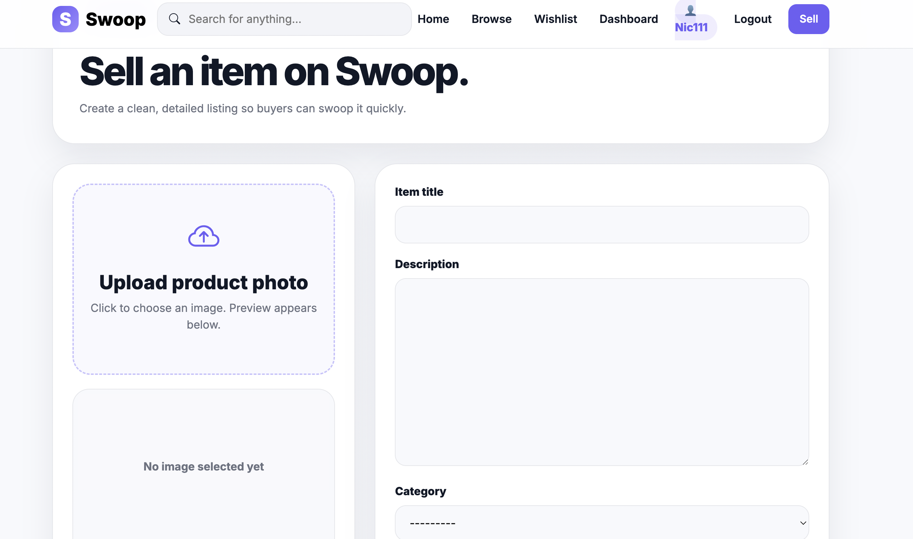 |
| Read | Listing displayed correctly  | 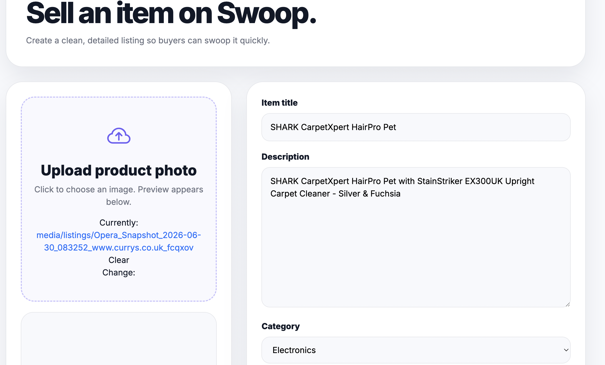 |
| Update | Listing updated  | 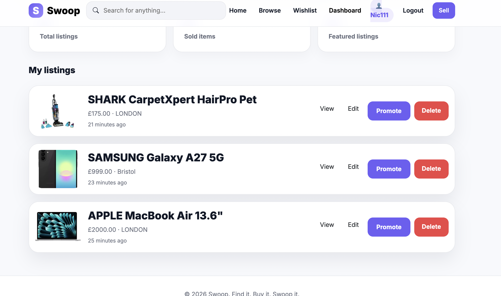 |
| Delete | Listing removed  | 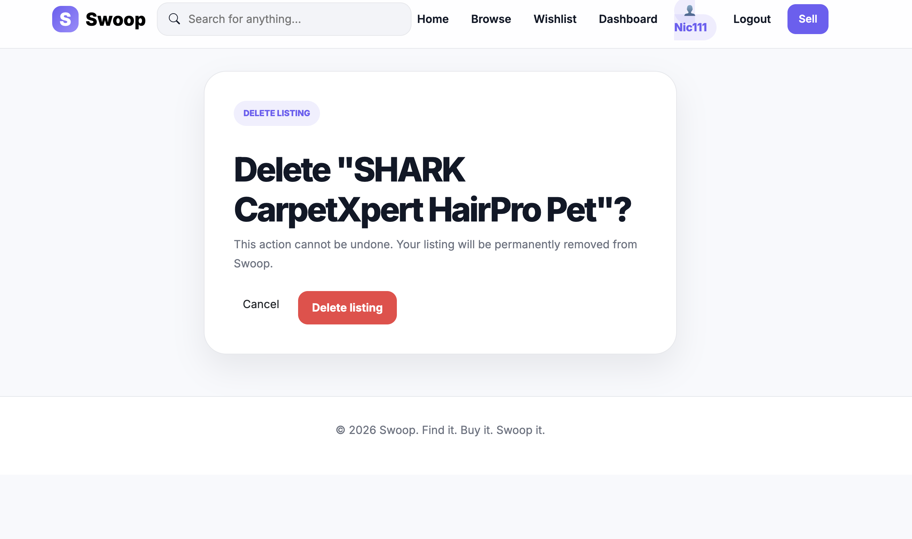 |

---

## Wishlist

| Operation | Expected Behaviour | Evidence |
|-----------|-------------------|:---------|
| Add | Listing saved |  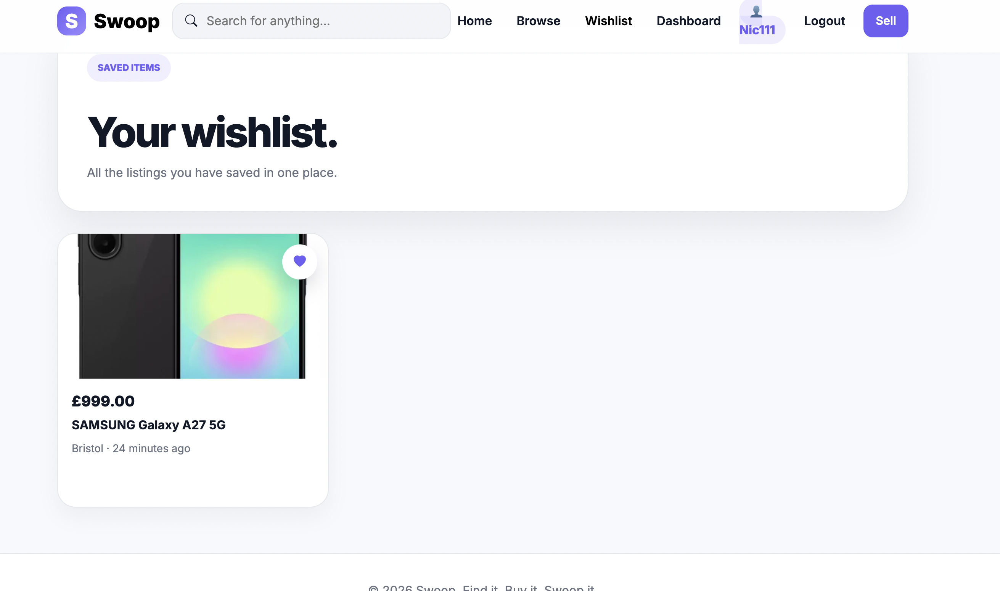 |
| Remove | Listing removed  | 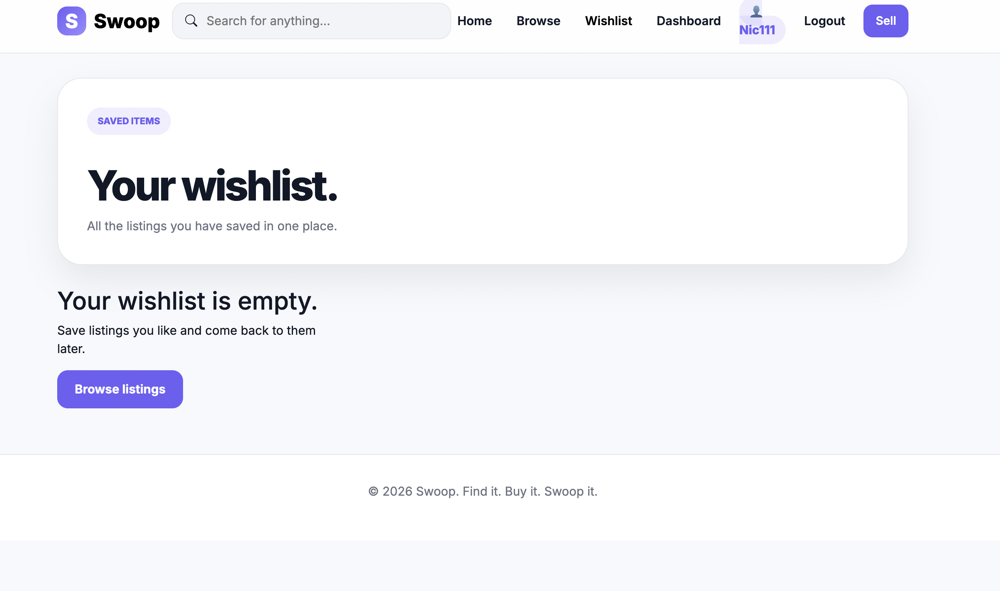 |

---

# Authentication Testing

| Test | Expected Result | 
|------|-----------------|
| Register | Account created |
| Login | User authenticated | 
| Logout | Session ended | 
| Password Validation | Invalid passwords rejected | 
| Protected Views | Redirect unauthenticated users | 

---

# Stripe Payment Testing

## Product Purchase

| Test | Expected Result | Status | Evidence |
|------|-----------------|:------:|---------|
| Checkout Session | Stripe page opens | ✅ | 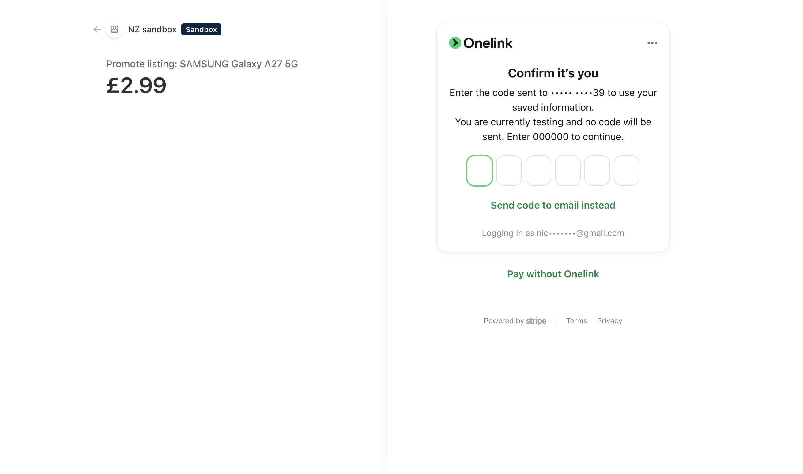 |
| Successful Payment | Purchase completed | ✅ | 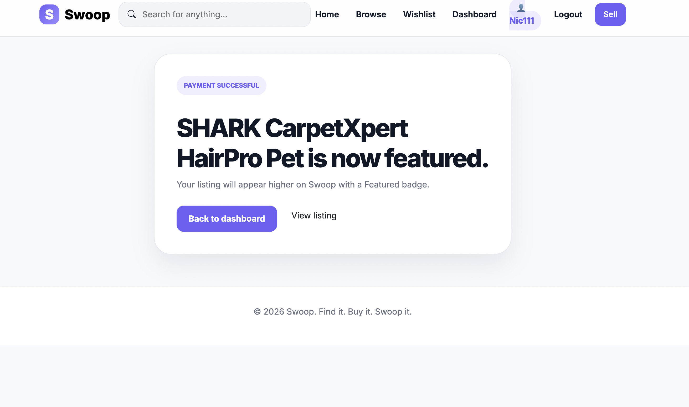 |

---

## Listing Promotion

| Promotion Email | Email received | 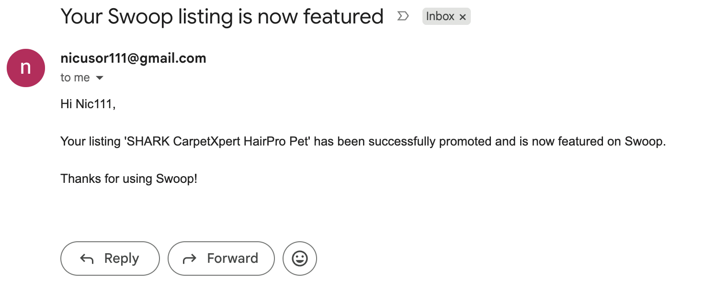 

---

# Cloudinary Testing

| Test | Expected Result | Status | Evidence |
|------|-----------------|:------:|---------|
| Upload Image | Image stored in Cloudinary | ✅ |  |
| Display Image | Image loads correctly | ✅ |  |
| Deployment Persistence | Images remain after deployment | ✅ |  |

---

# Email Testing


| Promotion Confirmation | Email received|  

---

# Responsive Testing

The application was tested using Chrome Developer Tools across multiple viewport sizes.

| Device | Status | Evidence |
|---------|:------:|---------|
| Desktop/Laptop | ✅ | 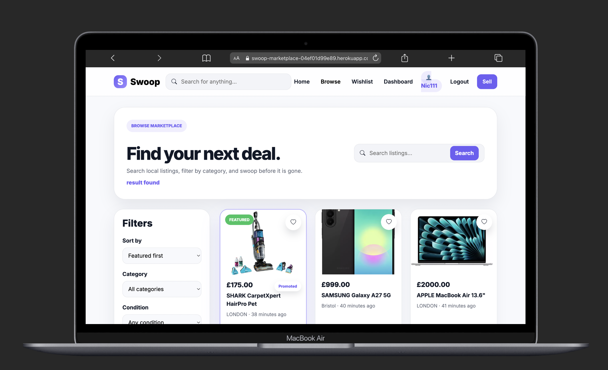 |
| Tablet | ✅ | 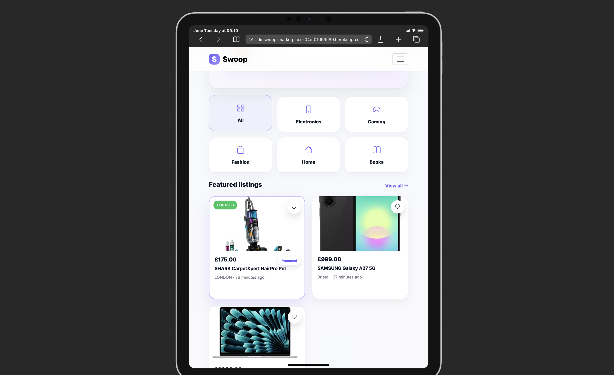 |
| Mobile | ✅ | 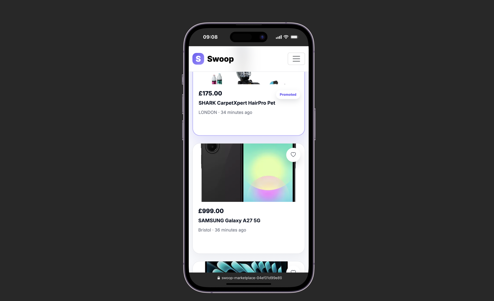 |

---

# Browser Compatibility

The application was tested in the following browsers.

| Browser | Status |
|----------|:------:|
| Google Chrome | ✅ |
| Mozilla Firefox | ✅ |
| Microsoft Edge | ✅ |
| Safari | ✅ |

---

# HTML Validation

HTML validation was carried out using the W3C Markup Validation Service.

### Validation Evidence

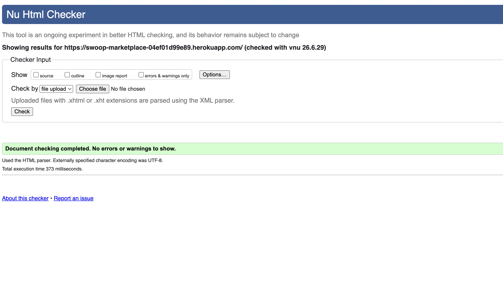


---

# CSS Validation

CSS validation was performed using the W3C CSS Validator.

Result:

### Validation Evidence

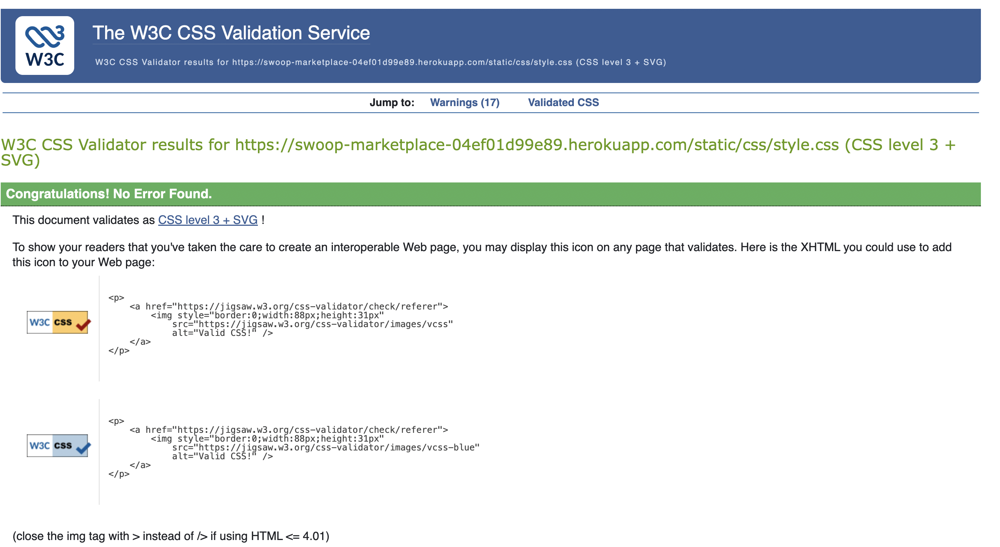

---

# Lighthouse Testing

Google Lighthouse was used to evaluate the application's performance, accessibility, best practices and SEO.

### Homepage

#### Desktop

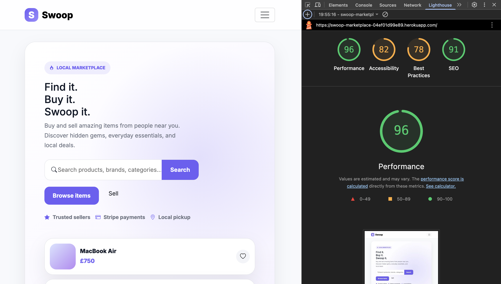

#### Mobile
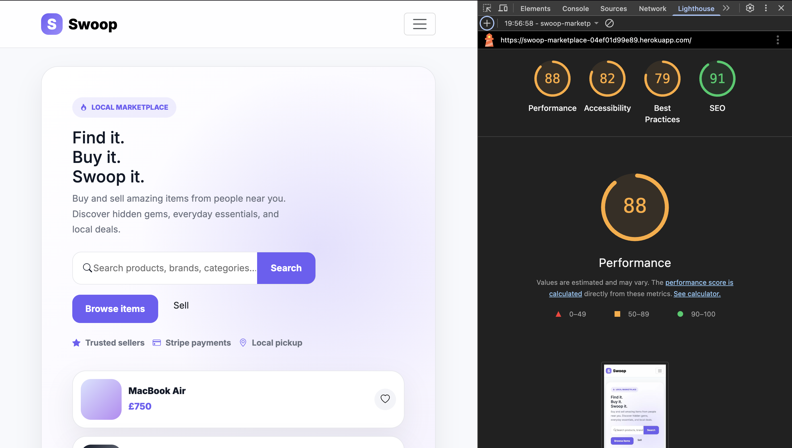

---


# Testing Summary

All core functionality was tested successfully.

The application met the expected behaviour for authentication, CRUD operations, Stripe payments, Cloudinary image management, transactional email delivery, responsive layouts and browser compatibility.

No critical defects remained at the time of deployment.

---

# 16. Validation


---

# 17. Bugs & Fixes


Throughout the development of Swoop, several technical challenges were encountered and resolved. The following section documents the most significant issues together with the implemented solutions.

---

# Cloudinary Media Storage

## Issue

Uploaded product images displayed correctly during local development but disappeared after deploying the application to Heroku.

## Cause

Media files were being stored on Heroku's ephemeral filesystem, which is reset whenever the application is redeployed.

## Solution

Cloudinary was integrated as the default media storage backend using `django-cloudinary-storage`.

Uploaded images are now stored permanently in Cloudinary and served through secure CDN URLs.

### Evidence


---

# Heroku Static Files

## Issue

The application deployed successfully, but CSS and JavaScript assets were not loading correctly.

## Cause

The static file configuration contained duplicate storage settings, preventing `collectstatic` from correctly processing project assets.

## Solution

The static file configuration was simplified and corrected by:

- Removing duplicate storage definitions.
- Configuring WhiteNoise for static asset serving.
- Verifying successful `collectstatic` execution during deployment.

### Evidence


---

# WhiteNoise Configuration

## Issue

Running `collectstatic` generated errors relating to missing Django admin static assets.

## Cause

Conflicting static file storage settings caused WhiteNoise to attempt processing non-existent files.

## Solution

The static file configuration was simplified and verified until `collectstatic` completed successfully.

### Evidence


---

# PostgreSQL Deployment

## Issue

The application initially used SQLite during development but required PostgreSQL for production deployment.

## Cause

Separate database configurations were required for local development and production.

## Solution

`dj-database-url` was implemented to dynamically configure the appropriate database based on the deployment environment.

### Evidence


---

# Gmail SMTP

## Issue

Transactional emails were not being delivered.

## Cause

SMTP credentials had not been configured correctly.

## Solution

A Gmail App Password was generated and stored securely using environment variables.

Transactional emails are now sent for:

- Listing promotions
- Marketplace purchases
- Seller notifications

### Evidence


---

# Stripe Checkout

## Issue

Payment sessions initially failed due to missing API credentials.

## Cause

Stripe environment variables were not configured within the production environment.

## Solution

Production API keys were added to Heroku Config Vars, allowing Stripe Checkout sessions to be created successfully.

### Evidence


---

# Authentication

## Issue

Unauthenticated users could attempt to access protected views.

## Solution

Protected views were secured using Django's authentication decorators and permission checks.

Users are now redirected to the login page before accessing restricted functionality.

### Evidence


---

# Lessons Learned

Developing Swoop provided valuable experience with production deployment and cloud service integration.

The project strengthened practical understanding of:

- Django configuration
- Environment variable management
- Cloudinary media storage
- Stripe payment processing
- PostgreSQL deployment
- WhiteNoise static file handling
- Heroku deployment
- Transactional email delivery
- Debugging production issues

Each challenge improved the overall reliability, scalability and maintainability of the application.

---

# 18. Deployment

## Overview

Swoop was developed locally using Visual Studio Code before being deployed to Heroku as a production-ready web application.

The deployment process involved configuring PostgreSQL, Cloudinary, Stripe, Gmail SMTP and environment variables to create a scalable and secure production environment.

---

# Local Development

## Prerequisites

Before running the project locally, ensure the following software is installed:

- Python 3.12+
- Git
- PostgreSQL (optional for local development)
- Visual Studio Code (recommended)

---

## Clone the Repository

```bash
git clone https://github.com/Nic1Mic/swoop.git
cd swoop
```

---

## Create a Virtual Environment

### Windows

```bash
python -m venv venv
venv\Scripts\activate
```

### macOS / Linux

```bash
python3 -m venv venv
source venv/bin/activate
```

---

## Install Dependencies

```bash
pip install -r requirements.txt
```

---

## Configure Environment Variables

Create a `.env` file in the project root and configure the following variables:

```env
SECRET_KEY=

DEBUG=True

DATABASE_URL=

SITE_URL=

STRIPE_PUBLIC_KEY=
STRIPE_SECRET_KEY=

CLOUDINARY_CLOUD_NAME=
CLOUDINARY_API_KEY=
CLOUDINARY_API_SECRET=

EMAIL_HOST_USER=
EMAIL_HOST_PASSWORD=
DEFAULT_FROM_EMAIL=
```

---

## Apply Database Migrations

```bash
python manage.py migrate
```

---

## Create a Superuser

```bash
python manage.py createsuperuser
```

---

## Run the Development Server

```bash
python manage.py runserver
```

The application will now be available at:

```
http://127.0.0.1:8000
```

---

# Production Deployment

The production application is deployed using Heroku.

## Deployment Steps

### 1. Create a Heroku Application

Create a new Heroku application and connect it to the GitHub repository.

---

### 2. Configure Config Vars

The following environment variables were added within the Heroku dashboard:

| Variable | Purpose |
|-----------|---------|
| SECRET_KEY | Django Secret Key |
| DATABASE_URL | PostgreSQL Database |
| STRIPE_PUBLIC_KEY | Stripe Public API Key |
| STRIPE_SECRET_KEY | Stripe Secret API Key |
| CLOUDINARY_CLOUD_NAME | Cloudinary Configuration |
| CLOUDINARY_API_KEY | Cloudinary Configuration |
| CLOUDINARY_API_SECRET | Cloudinary Configuration |
| EMAIL_HOST_USER | Gmail SMTP |
| EMAIL_HOST_PASSWORD | Gmail App Password |
| DEFAULT_FROM_EMAIL | Default Sender Address |
| SITE_URL | Production Domain |

---

### 3. Database Migration

After deployment, database migrations were applied:

```bash
heroku run python manage.py migrate
```

---

### 4. Collect Static Files

Static files were collected automatically during deployment using:

```bash
python manage.py collectstatic --noinput
```

---

### 5. Launch

Once deployment completed successfully, the production application became available at:

https://swoop-marketplace-04ef01d99e89.herokuapp.com/

---

# Deployment Architecture

```
Developer

↓

Git

↓

GitHub

↓

Heroku

↓

Gunicorn

↓

Django

↓

PostgreSQL

↓

Cloudinary

↓

Stripe

↓

Gmail SMTP
```


---

# Continuous Deployment

The project uses Git for version control.

Typical deployment workflow:

```bash
git add .

git commit -m "Commit message"

git push origin main
```

Once pushed to GitHub, Heroku automatically builds and deploys the latest version of the application.

---

# Deployment Verification

The production deployment was verified by confirming that:

- User registration functions correctly.
- User authentication works as expected.
- Listings can be created.
- Images upload successfully to Cloudinary.
- Stripe Checkout completes payments.
- Transactional emails are delivered.
- Static assets load correctly.
- PostgreSQL stores production data.
- Responsive layouts function across supported devices.

All deployment tests passed successfully.

---

# 19. Future Improvements

Although Swoop is fully functional in its current state, several enhancements have been identified for future development. These improvements focus on increasing usability, expanding marketplace functionality and improving the overall user experience.

The roadmap below categorises planned enhancements into short-term, medium-term and long-term goals.

---

# Short-Term Enhancements

The following features would significantly improve usability and are considered the highest priority for future releases.

## Email Verification

New users will be required to verify their email address before accessing marketplace functionality.

### Benefits

- Improved account security
- Reduced spam registrations
- Verified marketplace users

---

## Password Reset

Allow users to securely reset forgotten passwords via email.

### Benefits

- Improved account recovery
- Better user experience
- Reduced administrator support

---

## User Profile Management

Expand user accounts to include editable profiles.

Planned features include:

- Profile picture
- Biography
- Contact preferences
- Social media links

---

## Seller Avatars

Allow sellers to upload profile images.

Benefits include:

- Improved trust
- Better marketplace identity
- More engaging seller profiles

---

# Medium-Term Enhancements

These features would improve interaction between buyers and sellers.

## Direct Messaging

Allow buyers and sellers to communicate securely within the platform.

Potential functionality:

- Private conversations
- Product enquiries
- Read receipts
- Conversation history

---

## Seller Reviews

Buyers will be able to leave reviews after completing purchases.

Possible review information:

- Rating
- Written review
- Purchase verification

---

## Seller Ratings

Generate seller ratings based on marketplace activity.

Possible metrics include:

- Average review score
- Total sales
- Response time
- Account age

---

## Saved Searches

Allow users to save frequently used search criteria.

Benefits include:

- Faster browsing
- Personalised experience
- Improved usability

---

## Notifications

Implement an in-application notification centre.

Potential notifications:

- New messages
- Purchase confirmations
- Listing sold
- Wishlist price changes
- Featured listing expiry

---

# Long-Term Roadmap

The following enhancements would significantly extend the functionality of the marketplace.

## REST API

Develop a RESTful API using Django REST Framework.

Potential endpoints:

- Listings
- Users
- Categories
- Orders
- Payments

Benefits include:

- Third-party integrations
- Mobile application support
- Public developer API

---

## Mobile Application

Develop native mobile applications.

Potential platforms:

- Android
- iOS

---

## Advanced Search

Expand the search system to support:

- Price range
- Distance
- Condition
- Date listed
- Category combinations
- Featured listings only

---

## Real-Time Notifications

Implement WebSocket support using Django Channels.

Potential features:

- Live messaging
- Instant purchase notifications
- Live wishlist updates

---

## Multi-Language Support

Introduce internationalisation (i18n) to support multiple languages.

Potential initial languages:

- English
- Romanian
- Spanish
- French
- German

---

## Admin Analytics Dashboard

Develop a dedicated analytics dashboard for administrators.

Potential statistics:

- Total users
- Active listings
- Revenue
- Marketplace growth
- Most popular categories
- Daily registrations

---

# Project Roadmap

| Feature | Priority | Status |
|-----------|:-------:|:------:|
| Email Verification | High | 🔜 Planned |
| Password Reset | High | 🔜 Planned |
| User Profile Editing | High | 🔜 Planned |
| Seller Avatars | Medium | 🔜 Planned |
| Direct Messaging | Medium | 🔜 Planned |
| Seller Reviews | Medium | 🔜 Planned |
| Seller Ratings | Medium | 🔜 Planned |
| Saved Searches | Medium | 🔜 Planned |
| Notifications | Medium | 🔜 Planned |
| Advanced Search Filters | Medium | 🔜 Planned |
| REST API | Long-Term | 🔜 Planned |
| Mobile Application | Long-Term | 🔜 Planned |
| AI Recommendations | Long-Term | 🔜 Planned |
| Multi-Language Support | Long-Term | 🔜 Planned |

---

# Future Vision

The long-term vision for Swoop is to evolve from a portfolio project into a feature-rich marketplace platform that demonstrates production-quality software engineering principles.

Future development will continue to focus on:

- Scalability
- Performance
- Security
- User experience
- Maintainability
- Accessibility
- Cloud-native architecture

The modular architecture implemented throughout the project provides a solid foundation for these future enhancements without requiring significant changes to the existing codebase.

---

# 20. Credits

The development of Swoop was supported by official documentation, educational resources and industry-standard tools. These resources were used for research, troubleshooting and implementation throughout the project.

## Framework & Language Documentation

- Django Documentation
- Python Documentation

## Frontend Resources

- Bootstrap 5 Documentation
- Bootstrap Icons
- Google Fonts (Inter)

## Third-Party Services

- Stripe Documentation
- Cloudinary Documentation
- Heroku Documentation

## Development Resources

- Git Documentation
- GitHub Documentation
- MDN Web Docs
- W3Schools (general HTML/CSS reference)

## Validation Tools

The project was validated using:

- W3C HTML Validator
- W3C CSS Validator
- CI Python Linter / PEP8 Validator
- Google Lighthouse

## Testing

Testing was carried out manually throughout development, covering:

- Authentication
- CRUD functionality
- Payments
- Seller Profiles
- Wishlists
- Cloudinary uploads
- Email notifications
- Responsive design
- Browser compatibility

Evidence of testing can be found throughout the Testing section of this documentation.

## Acknowledgements

This project was developed as a portfolio application to demonstrate full-stack web development using Django and modern cloud technologies.

Special thanks to:

- The Django community for outstanding documentation.
- Stripe for comprehensive payment documentation.
- Cloudinary for reliable cloud media storage.
- Bootstrap for responsive UI components.
- Heroku for cloud deployment services.

All application code and implementation were developed specifically for this project.

---

# 21. Author

**Nicu Mic**

GitHub: https://github.com/Nic1Mic